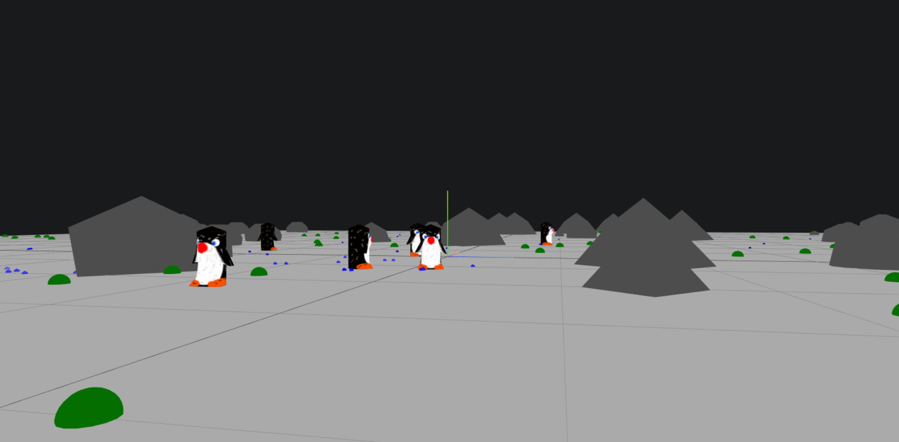
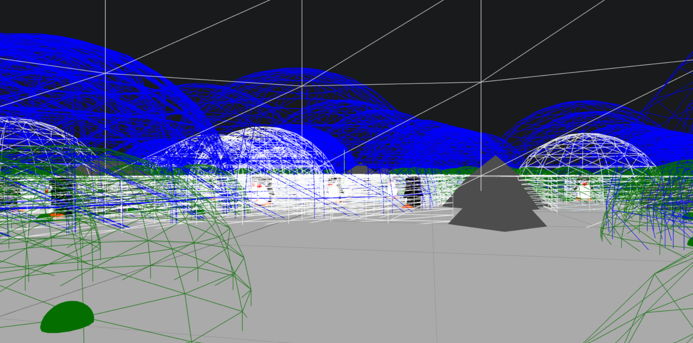

<div align="center">
  
  <h1><b>Pingu</b></h1>
  <h3>An autonomous envirement in ThreeJS</h3>
</div>

</br></br>



# 📝 Description of the project

Project realised by `Elouan EVEN` and `Dorian LEVEQUE` in the IEVA module (Interaction with Virtual or Augmented Reality Environments) of our dual degree SIIA (Intelligent and Autonomous Interactive System).
This project was about successfully setting up an autonomous and interactive environment.

You are projected into a virtual world in low-polygon in the middle of a penguin colony. 

In this colony, there are 10 penguins with a predefined programming and 10 others reacting to the behaviour of the others via Reynolds' Bolds movements. 

If you get too close to the penguins (not Reynolds) and he sees you, he will flee as far away from you as possible. 
As soon as they are hungry, they will look for grass to eat.
They will be attracted to the pheromones released by other penguins to follow them and will stop in front of them as soon as they get close enough. 



A debugger display can be activate with the `h` key to help you to see the different area of trigger.

# 📕 Report
The project report is available [here](./Rapport_LEVEQUE_EVEN.pdf)

# 📂 Contents of the repository

    |-assets: All the assets of the 3D world
    |-css: some style for the canvas
    |-docs: the docs used during the project.
    |-lib: libs used, three.js, some modules to lodding objects and to get the FPS vue.
    |-src
      |-actors: all the agent of the project
        |-components: all the component to adding behaviour to the agent
        |-triggers: all the triggers (Nimbus, Focus, Area)
          |-regions: regions for the trigger
      App.js: the main App 😀.
      Prims.js: package to create 3d figures.
      Sim.js: abstract class to describe the simulator.
      Utils.js: some useful function.
    |-index.html 
    |-index.js

# 📦 Installation

We used during the development NPM to download the three.module.js of the lib and get the self-completion in VSCode. 
Also with NPM, we used browsersync that refresh automatically the page when one of the files changed and create a server to open the project without having to disable browser security rules.

If you don't wan't disabled security rules to load the 3d models. You have to follow these instructions:

1. Install [Node.js](https://nodejs.org/en/download/)

2. Clone the GitLab repository to your directory
```bash
git clone https://git.enib.fr/team-tiketo/three-js.git
```

3. Go to the directory using a terminal
```bash
cd three-js
```

4. Install the npm modules
```bash
npm install
```

# 📜 Execution

If you followed the previous instructions, just open a terminal and execute

```bash
npm start
```
A web page will open automatically at localhost:3000.

If you don't install, you can still open a browser and open the index.html file, but you must first disable the following security rule ( security.fileuri.strict_origin_policy )
